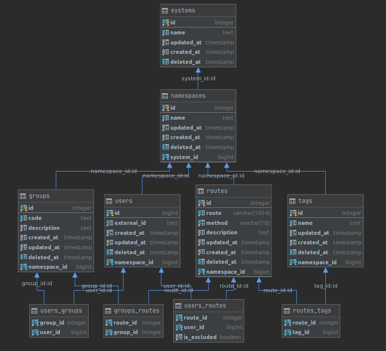

# BZDACS - simple lightweight access control system
## Goal - allows setting certain policy for certain user in terms of api routes
##[Demo](http://bzdacs.eblog.cyou/)

## Stack
- [Postgres](https://github.com/postgres/postgres)
- [VueJS 2.x](https://github.com/vuejs/vue) ([typescript](https://github.com/microsoft/TypeScript))
- [Golang](https://github.com/golang/go)

    
Database schema

    {:class="img-responsive"}

### build
> sh build.sh
### local 
via docker-compose
> docker-compose -f docker-compose.build.yml up
### for contributors
server
> go run -config ./config/config.local.yaml

ui 
> npm run --prefix ./ui serve
 
 
# Swagger
[UI](http://bzdacs.eblog.cyou/api/swagger/index.html)
and
[Spec](http://bzdacs.eblog.cyou/api/swagger/source)